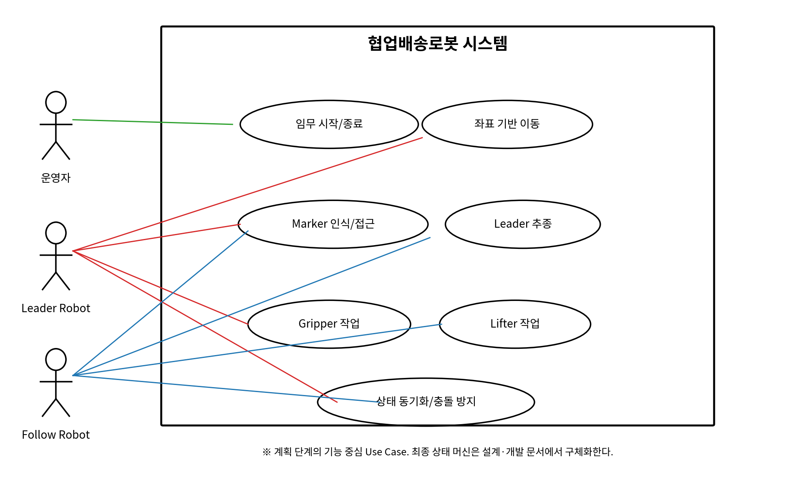
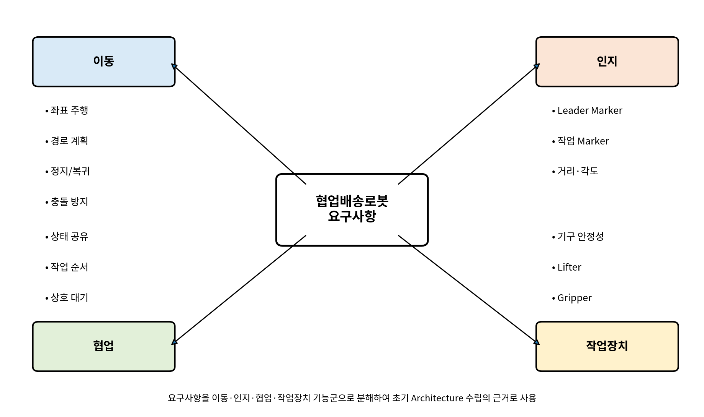
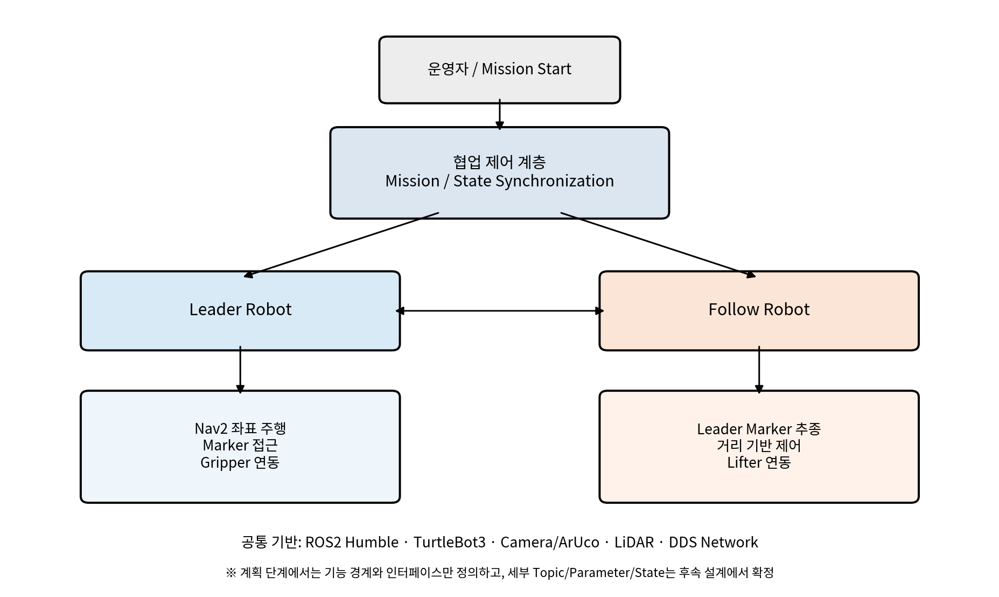
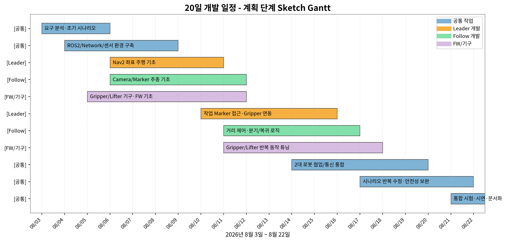

__Nav2 좌표 주행과 Marker 추종 제어기반의  
협업배송로봇시스템__

__프로젝트 계획서__

  

__프로젝트 기간__

2026\.08\.03 ~ 2026\.08\.22 \(20일\)

__개발 인원__

3명

__개발 대상__

TurtleBot3 기반 2대 협업배송로봇

__개발 방식__

반복형 Agile / Incremental Prototype

__문서 성격__

착수 단계 계획 및 초기 아키텍처 수립

*본 문서는 프로젝트 착수 시점의 계획과 가설을 재구성한 문서이며,  
후속 「설계 및 개발 문서」에서 변경·실패·개선 이력을 별도로 관리한다\.*

# 0\. 문서 목적 및 범위

본 계획서는 20일의 단기 개발 기간 동안 두 대의 이동로봇이 운반·작업을 분담하는 협업배송로봇시스템을 구현하기 위한 초기 계획을 정의한다\. 최종 구현 결과를 역으로 설명하기보다, 개발 착수 시점에서 어떤 문제를 인식했고 어떤 요구사항을 도출했으며 이를 어떤 기능 및 아키텍처로 연결할 것인지에 초점을 둔다\.

따라서 본 문서에서는 세부 State Machine, 최종 TP 동기화 규칙, 최종 Marker ID 및 세부 제어값을 확정 사항으로 다루지 않는다\. 이러한 요소는 Prototype 시험과 PDR/개선 과정을 거쳐 후속 설계·개발 문서에서 단계적으로 구체화한다\.

# 1\. 프로젝트 개요

__항목__

__계획 내용__

프로젝트명

Nav2 좌표 주행과 Marker 추종 제어기반의 협업배송로봇시스템

기간

2026년 8월 3일 ~ 8월 22일, 총 20일

인원

3명

플랫폼

TurtleBot3 Burger 2대 \+ Raspberry Pi \+ UVC Camera \+ LiDAR

기본 SW 환경

Ubuntu 22\.04\.5 LTS, ROS2 Humble, Nav2, ArUco Marker 인식

핵심 목표

좌표 기반 자율주행과 Marker 기반 상대 추종/정밀 접근을 결합하여 2대 로봇이 하나의 배송 임무를 역할 분담 방식으로 수행

## 1\.1 개발 역할 분담

__담당__

__주요 책임__

__계획 단계 핵심 산출물__

담당 A \- Leader 로봇 개발

Nav2 좌표 주행, 작업 Marker 접근, Gripper 연동, 복귀/주차 기능

Leader 기능 목록, 초기 주행/접근 인터페이스, 단위시험 항목

담당 B \- Follow 로봇 개발

Leader Marker 추종, 거리 기반 제어, 작업 분기/복귀, Lifter 연동

Follower 기능 목록, 추종 제어 조건, 안전거리 요구사항

담당 C \- Gripper/Lifter FW 및 기구 개발

Gripper/Lifter 구동 FW, 모터·서보 제어, 전원·배선, 브래킷·기구 설계

I/O 명세, 동작 요구, 기구 제작/조립 계획

# 2\. 개발 배경

물류·제조 환경의 반복 운반 작업은 이동 기능뿐 아니라 적재, 집기, 상·하차, 작업 위치 정렬과 같은 부가 작업을 동시에 요구한다\. 하나의 이동로봇에 모든 기능을 집중하면 기구 복잡도와 제어 복잡도가 증가하고, 작업 변경 시 시스템 전체를 수정해야 하는 부담이 커질 수 있다\.

본 프로젝트는 이를 역할 분담형 협업 구조로 접근한다\. 한 로봇은 좌표 기반 이동과 물체 취급을 중심으로 담당하고, 다른 로봇은 선행 로봇을 Marker로 추종하면서 별도의 적재·리프팅 작업을 수행한다\. 즉, 각 로봇의 장점을 분리하면서도 하나의 배송 임무 흐름 안에서 상호 대기와 작업 순서를 맞추는 시스템을 목표로 한다\.

또한 넓은 구간에서는 Nav2의 좌표 기반 이동을 사용하고, 로봇 간 상대 위치나 작업 대상과의 최종 접근처럼 국소 정밀성이 필요한 구간에서는 Marker 추종 제어를 사용하는 Hybrid Navigation 개념을 초기 설계 방향으로 설정한다\.

# 3\. 사회적 과제 추론 및 문제 정의

본 프로젝트는 특정 통계 수치를 전제로 하기보다, 현장 자동화에서 반복적으로 나타나는 운영상의 과제를 프로젝트 관점에서 추론하여 요구사항으로 전환한다\.

__사회적/운영상 과제__

__프로젝트 관점의 문제__

__설계 요구로의 전환__

반복 운반 업무의 자동화 요구

사람이 수행하던 단순 이동·적재 업무를 로봇이 안정적으로 반복해야 함

자율 이동, 작업 위치 접근, 반복성 있는 작업 시퀀스 필요

단일 로봇의 복잡도 증가

이동·집기·리프팅을 한 플랫폼에 모두 통합하면 기구·제어 변경 부담이 커짐

기능 분담형 2대 로봇 구조 및 모듈화

다중 로봇의 충돌 가능성

두 로봇이 동일 통로와 작업 구역을 공유할 경우 이동 순서가 충돌할 수 있음

상호 대기, 작업 허가, 안전거리, 정지 조건 필요

작업 위치의 정밀 접근 필요

맵 좌표만으로는 물체·기구 앞 최종 자세 오차가 발생할 수 있음

Marker 기반 거리·각도 보정 필요

통신/센서 불확실성

무선 DDS, 카메라 검출 지연, Marker 손실 등에 따라 상태가 순간적으로 불안정해질 수 있음

재시도, 정지 우선, 상태 확인 기반 제어 필요

## 3\.1 문제 정의

“두 대의 이동로봇이 서로 다른 작업 장치를 갖고 동일한 배송 임무를 수행할 때, 각 로봇의 이동과 작업을 어떻게 분담하고, 언제 상대 로봇의 완료를 확인한 뒤 다음 단계로 전환할 것인가?”를 본 프로젝트의 핵심 문제로 정의한다\.

# 4\. 목표 및 성공 기준

__구분__

__초기 목표__

__계획 단계 성공 기준__

이동

Leader가 지정된 작업 구간으로 자율 이동

Nav2 기반 좌표 Goal 주행이 반복적으로 가능

추종

Follower가 Leader를 Marker로 인식하여 따라감

Leader Marker 검출, 방향 보정, 거리 기반 감속/정지 가능

작업

Leader는 Gripper, Follower는 Lifter를 사용

각 장치의 단독 OPEN/CLOSE 또는 UP/DOWN 제어 가능

협업

두 로봇이 서로의 작업 완료를 확인하며 순차 진행

상호 상태 전달 인터페이스를 정의하고 통합 시험 가능

정밀 접근

작업 Marker를 기준으로 최종 위치 보정

작업 위치에서 Marker 거리·각도 기반 접근/정지 가능

안전

추종 및 교차 구간에서 충돌 위험 최소화

거리 임계값, 정지 우선, 순서 제어 적용

# 5\. 요구사항 정리

## 5\.1 기능 요구사항

__ID__

__요구사항__

__우선순위__

FR\-01

Leader 로봇은 지정된 좌표 또는 작업 대기 위치로 이동할 수 있어야 한다\.

Must

FR\-02

Follower 로봇은 Leader 로봇의 Marker를 인식하여 상대 위치를 추정할 수 있어야 한다\.

Must

FR\-03

Follower 로봇은 Leader와의 거리에 따라 추종 속도를 조절하고 안전거리 안에서는 정지할 수 있어야 한다\.

Must

FR\-04

두 로봇은 작업 Marker를 인식하여 일정 거리와 방향으로 접근할 수 있어야 한다\.

Must

FR\-05

Leader 로봇은 Gripper를 이용해 물체 집기/놓기 작업을 수행할 수 있어야 한다\.

Must

FR\-06

Follower 로봇은 Lifter를 이용해 Pallet 상·하차 작업을 수행할 수 있어야 한다\.

Must

FR\-07

두 로봇은 상대 로봇의 이동/작업 완료 상태를 공유하고 다음 행동을 동기화할 수 있어야 한다\.

Must

FR\-08

작업 실패 또는 Marker 손실 시 로봇은 무조건 진행하지 않고 정지 또는 재탐색 상태로 전환할 수 있어야 한다\.

Should

FR\-09

임무 종료 후 각 로봇은 지정된 종료 또는 주차 상태로 전환할 수 있어야 한다\.

Should

## 5\.2 비기능 요구사항

__ID__

__비기능 요구사항__

NFR\-01 안전성

Follower 추종은 속도보다 안전거리 확보를 우선한다\.

NFR\-02 모듈성

주행, Marker, 장치 제어, 협업 상태는 독립적으로 시험 가능한 단위로 구성한다\.

NFR\-03 통신성

2대 로봇과 제어 PC가 동일 네트워크에서 ROS2 DDS 통신을 수행할 수 있어야 한다\.

NFR\-04 식별성

다중 로봇 운용 시 센서/주행 Topic과 Node가 서로 혼선되지 않도록 식별 체계를 고려한다\.

NFR\-05 조정성

속도, 거리, Marker 기준값 등은 반복 시험을 통해 조정 가능하도록 설계한다\.

NFR\-06 복구성

Marker 손실, 통신 지연, Nav2 실패 등에서 무조건 진행하지 않고 안전 상태로 복귀할 수 있어야 한다\.

# 6\. 요구사항에서 시스템 기능으로의 추론

요구사항을 바로 ROS Node나 Source 구조로 치환하지 않고, 먼저 사용자가 기대하는 기능과 로봇의 역할을 Use Case로 정리한다\. 이후 기능을 이동·인지·협업·작업장치의 네 기능군으로 분해하고, 마지막에 이를 초기 아키텍처의 모듈로 연결한다\.

그림 1\. 계획 단계 Use Case Diagram

그림 2\. 요구사항 기반 기능 분해 Mind Map

## 6\.1 요구사항\-기능 추적 관계

__요구사항 군__

__핵심 기능__

__예상 구현 영역__

__주 담당__

자율 이동

좌표 Goal, 경로 계획, 복귀

Nav2 / Odometry / cmd\_vel

Leader

상대 추종

Leader Marker 인식, 거리·방향 제어

Camera / ArUco / cmd\_vel

Follow

작업 접근

작업 Marker 탐색, 거리·각도 정렬

ArUco / Odometry

Leader \+ Follow

작업 장치

집기/놓기, 리프트 상·하차

Gripper FW / Lifter FW / Mechanism

FW·기구

협업 제어

상태 공유, 작업 순서, 상호 대기

ROS2 Communication / Mission Logic

Leader \+ Follow

안전/복구

최소거리 정지, Marker 손실 대기, 통신 이상 정지

Follower Logic / Mission Logic

공통

# 7\. 초기 시스템 아키텍처 수립

초기 아키텍처는 최종 노드 구성보다 기능 경계와 인터페이스를 먼저 정의한다\. Leader와 Follow는 각각 독립적으로 주행 및 작업 기능을 수행하며, 상위의 협업 제어 계층이 상대 상태를 확인해 다음 단계의 실행 시점을 조율하는 구조를 가정한다\.

그림 3\. 요구사항으로부터 도출한 초기 시스템 아키텍처

## 7\.1 초기 기술 구성

__계층__

__계획 기술__

__선정 이유__

로봇 플랫폼

TurtleBot3 Burger

차동 구동 및 ROS2 기반 개발 환경 활용

운영체제/미들웨어

Ubuntu 22\.04\.5 LTS / ROS2 Humble

로봇 센서·주행·통신 모듈 통합

좌표 주행

Nav2

맵 기반 좌표 Goal 주행과 경로 계획

정밀 인지

UVC Camera \+ ArUco Marker

저비용 ID 식별과 상대 위치 추정

거리/자세

Odometry \+ Marker Pose

회전·이동량 및 상대 접근 보정

로봇 간 통신

ROS2 DDS over LAN

2대 로봇과 PC 간 분산 통신

작업 장치

Gripper / Lifter FW

배송 대상과 Pallet 작업을 역할 분담

## 7\.2 계획 단계 인터페이스 원칙

- 로봇별 주행·센서 정보는 서로 섞이지 않도록 구분 가능한 이름 체계를 사용한다\.
- 협업 상태 정보는 단일 소유 또는 명확한 책임 주체를 두어 중복 제어를 방지한다\.
- Gripper/Lifter 제어는 로봇 Mission Logic과 분리하여 단독 시험이 가능해야 한다\.
- Marker 인식이 끊기거나 통신 상태가 불명확한 경우 진행보다 정지를 우선한다\.

# 8\. 개발 전략

20일이라는 짧은 개발 기간을 고려하여, 처음부터 모든 기능을 완성한 뒤 통합하는 방식보다 최소 기능을 빠르게 연결하고 시험 결과를 다음 설계에 반영하는 반복형 개발 방식을 계획한다\. 이 계획서는 초기 방향을 제시하며, 실제 변경 이력은 후속 설계·개발 문서에서 Sprint 단위로 기록한다\.

__단계__

__목표__

__계획 산출물__

Sprint 0 \- 환경 구축

ROS2, TurtleBot3, Camera, LiDAR, Network 기본 구동 확인

환경 점검표, 기본 Topic/Node 목록

Sprint 1 \- 개별 기능

Leader 좌표 이동, Follow Marker 인식, Gripper/Lifter 단독 구동

Unit 기능 Prototype

Sprint 2 \- Pre\-MVP

2대 로봇 이동·추종·작업을 하나의 초기 시나리오로 연결

Pre\-MVP, PDR 검토 항목

Sprint 3 \- 협업 보완

통합 시험에서 발견된 충돌·순서·Marker/통신 문제를 수정

수정 시나리오, Integration Build

Sprint 4 \- MVP/통합

전체 Mission을 반복 수행 가능한 수준으로 통합

MVP, Test Case 초안

Sprint 5 \- 마무리

최종 시험, CDR 준비, 결과 문서화

Final Scenario 입력자료, 시험 로그

# 9\. 개발 일정 관리

개발 일정은 공통 기반 작업과 3인의 병렬 개발을 함께 배치한다\. 계획 단계에서는 세부 수정 이력을 미리 확정하지 않고, 각 기간의 목표와 통합 시점을 중심으로 관리한다\.

그림 4\. 2026\.08\.03~08\.22 개발 계획 Sketch Gantt

## 9\.1 주차별/단계별 목표

__기간__

__공통 목표__

__Leader 담당__

__Follow 담당__

__FW·기구 담당__

8/03~8/06

요구 분석, ROS2/Network/센서 환경 점검

TurtleBot3/Nav2 기초 구동

Camera/Marker 기초 확인

기구 요구 및 구동 방식 정의

8/07~8/11

개별 기능 Prototype 확보

좌표 이동/회전/Goal 주행

Marker Pose/추종 제어

Gripper/Lifter 단독 구동

8/12~8/15

Pre\-MVP 및 초기 협업 연결

작업 Marker 접근/복귀

거리 기반 추종/작업 분기

기구 장착 및 반복 동작

8/16~8/20

통합 시험, 시나리오 수정 반복

협업 상태/하역/주차 보완

재합류/추종 안전성 보완

FW 동작시간·기구 안정성 튜닝

8/21~8/22

전체 Mission 시험 및 문서화

통합 시험 지원

통합 시험 지원

장치 시험 지원/정리

## 9\.2 주요 마일스톤

__Milestone__

__목표 시점__

__판정 기준__

M1 개발환경 확보

8/06

2대 로봇과 센서가 기본 구동되고 PC\-로봇 통신 가능

M2 개별기능 Prototype

8/11

좌표 이동, Marker 검출/추종, Gripper/Lifter 단독 동작 확인

M3 Pre\-MVP

8/15

2대 로봇이 초기 협업 시나리오를 부분적으로 수행

M4 Integration Build

8/20

통합 Mission을 기준으로 주요 문제 수정 및 반복 시험 가능

M5 Final Demo Ready

8/22

최종 시연 시나리오와 시험 결과 정리 완료

# 10\. 초기 위험요소 및 대응 계획

__Risk__

__예상 원인__

__영향__

__계획 대응__

R1 Marker 손실

카메라 지연, 조명, 회전 중 검출 실패

추종/작업 접근 중단

정지 후 재탐색, 검출 안정성 시험

R2 Follower 추돌

Leader 정지와 Follow 제어 지연

로봇 충돌

거리 임계값, 감속/정지 구간, 정지 우선

R3 ROS2 통신 혼선

동일 Domain의 중복 Node/Topic

잘못된 센서/상태 수신

로봇별 식별/namespace 원칙, 공유 상태 소유권 명확화

R4 Nav2 Goal 실패

Costmap, 초기 pose, 장애물 근접

Leader 주행 중단

Goal 전후 안전거리 확보, 실패 시 정지/재시도

R5 Gripper/Lifter 오동작

FW 명령·기구 방향 불일치, 전원 문제

작업 실패

단독 I/O 시험 후 통합, 명령\-실동작 매핑 확인

R6 일정 부족

3개 분야 병렬 개발과 통합 지연

최종 Mission 미완성

Must 기능 우선, Sprint 종료마다 동작 가능한 Build 유지

# 11\. 계획 산출물

__구분__

__산출물__

__비고__

계획

프로젝트 계획서

본 문서

설계/개발

초기 시나리오, PDR, Pre\-MVP, Sprint 수정 이력, MVP, 시험 기록, CDR

후속 문서로 분리

SW

Leader Robot Mission, Follow Robot Mission, ROS2 설정/실행 스크립트

버전별 변경 이력 관리

FW/기구

Gripper/Lifter FW, 회로/배선, 기구 모델/도면

단독 시험 및 통합 결과 포함

시험

Unit/Integration/System Test Case 및 결과

최종 결과 보고서에 요약

결과

최종 시나리오, 시스템 구성, 시연 결과, 개선 이력

개발 결과 보고서로 분리

# 12\. 계획 단계 결론

본 계획 단계에서는 “Nav2 좌표 주행 \+ Marker 기반 상대 추종/정밀 접근 \+ 역할 분담형 작업장치”를 핵심 기술 방향으로 설정한다\. 요구사항 분석 결과, 단순한 Leader\-Follower 이동만으로는 충분하지 않고 두 로봇의 작업 순서와 안전을 조율하는 협업 제어 계층이 필요하다는 가설을 수립한다\.

다만 협업 상태의 세부 규칙, 작업 분기 순서, 최종 State Machine과 세부 제어값은 계획 단계에서 고정하지 않는다\. 20일 동안 Prototype과 실제 로봇 시험을 반복하면서 문제를 발견하고 수정하며, 그 과정은 별도의 「설계 및 개발 문서」에서 Initial Scenario → PDR → Pre\-MVP → Scenario Revision → MVP → Test → Final Scenario → CDR → Final Model의 흐름으로 기록한다\.

