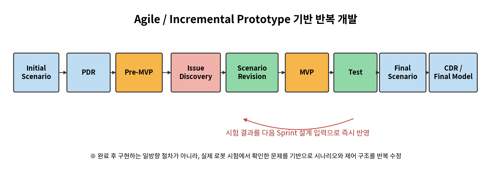
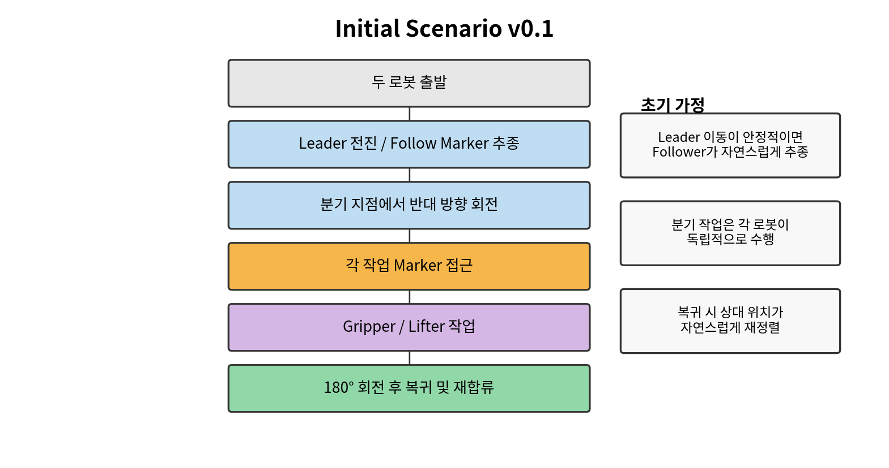
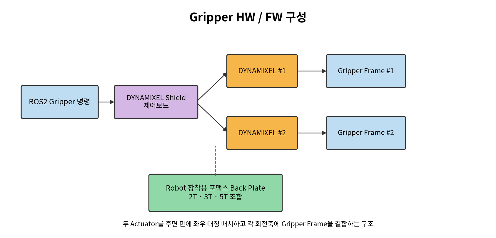
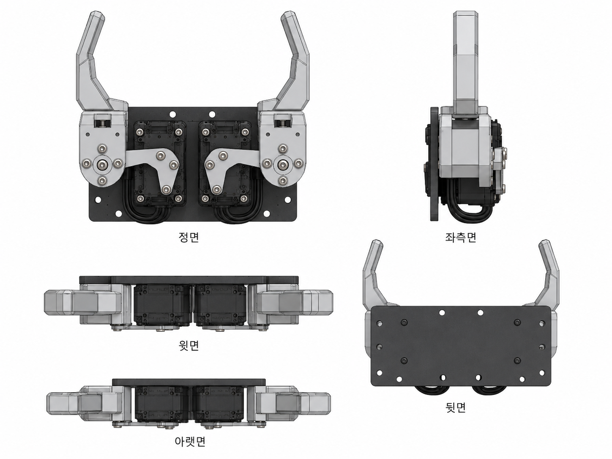
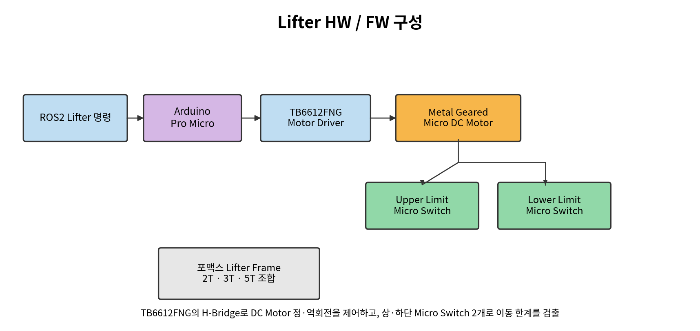
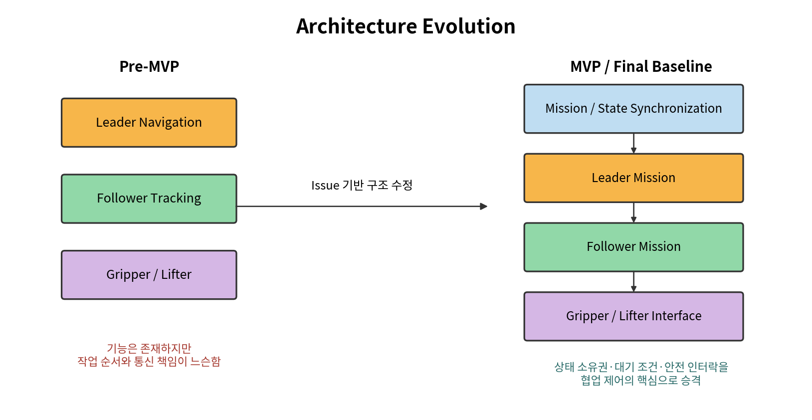
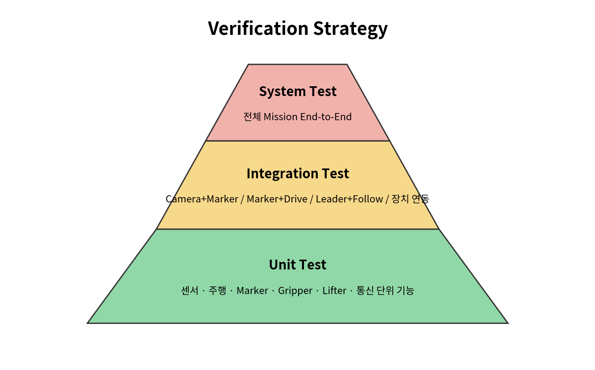
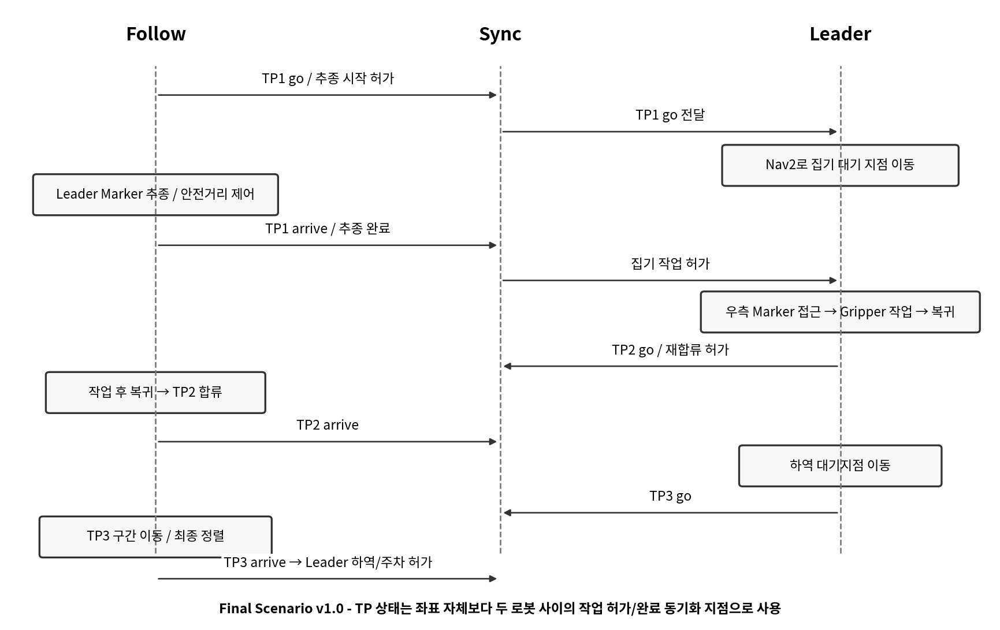

__Nav2 좌표 주행과 Marker 추종 제어기반의  
협업배송로봇시스템__

__02\. 시스템 설계 및 개발 문서__

*Initial Scenario → PDR → Pre\-MVP → Scenario Revision → MVP → Test → Final Scenario → CDR → Final Model*

__프로젝트 기간__

2026\.08\.03 ~ 2026\.08\.22

__문서 기준일__

2026\.08\.20

__개발 인원__

3명

__개발 방식__

Agile / Incremental Prototype

__문서 목적__

초기 설계부터 반복 수정, 시험, 최종 설계 Baseline까지의 개발 이력 정리

*※ 8월 21~22일의 최종 통합시험·시연 항목은 아직 수행 전이므로 “검증 예정”으로 구분한다\.*

# __0\. 문서 목적 및 개발 기록 원칙__

본 문서는 프로젝트 계획서에서 수립한 초기 요구사항과 Architecture를 실제 로봇에 적용하면서 어떻게 수정해 왔는지를 기록한다\. 완성된 결과만 제시하지 않고, 초기 가정이 실제 시험에서 실패한 지점, 원인 분석, 수정 방향, 다음 Sprint에서의 반영 결과를 중심으로 정리한다\.

개발 기록은 실제 진행 흐름에 맞춰 환경 구축 및 단위 기능 검증, 초기 시나리오와 PDR, Pre\-MVP, 통합 문제 발견, 시나리오 및 통신 구조 수정, MVP, 시험 설계, 최종 시나리오와 CDR 순으로 구성한다\. 소스 코드 자체는 포함하지 않고 시스템 동작과 설계 의사결정만 기술한다\.

그림 1\. 반복형 시스템 설계 및 개발 절차

# __1\. 개발 방법론 및 Sprint 운영__

20일이라는 짧은 개발 기간과 실제 로봇·센서·무선통신의 불확실성을 고려하여, 상세 설계를 모두 확정한 뒤 구현하는 방식보다 동작 가능한 최소 기능을 빠르게 만든 후 실제 장비에서 시험하고 수정하는 방식을 적용하였다\. Sprint 종료 시점마다 “동작하는 상태”를 확보하고, 발견된 문제를 다음 Sprint의 설계 입력으로 사용하였다\.

__Sprint__

__기간__

__개발 목표__

__주요 산출/결과__

__상태__

Sprint 0

8/03~8/06

ROS2·TurtleBot3·센서 기반 및 Gripper/Lifter 요구 정의

Robot bringup, LiDAR/Camera 통신, 장치 I/O·기구 개념안

완료

Sprint 1

8/07~8/12

좌표 주행·Marker·추종 \+ Gripper/Lifter Prototype 확보

Nav2/ArUco/추종, DYNAMIXEL Gripper, DC Motor Lifter, 포맥스 기구 제작

완료

Sprint 2

8/13~8/15

2대 로봇 \+ 작업장치 Pre\-MVP 통합

분기/복귀, Gripper/Lifter 장착·연동, 공유 상태 동기화 초안

완료

Sprint 3

8/16~8/18

통신·회전·시간동기·TP 구조 보완

상태 소유권, TP 노드 구조, 방향 수정, 동기화 안정화

완료

Sprint 4

8/19~8/20

추종 속도·안전거리·Leader Mission 통합

거리별 Follow 속도 조정, Leader 집기/복귀/하역/주차 구조

진행/완료

Sprint 5

8/21~8/22

최종 통합 시험·시연·문서화

End\-to\-End Test, CDR 확정, 최종 시연

검증 예정

# __2\. Initial Scenario v0\.1__

초기 시나리오는 두 로봇을 Leader와 Follower로 단순 분리하여, Leader가 정해진 경로를 이동하고 Follower가 Leader Marker를 추종한 뒤 작업 분기점에서 서로 반대 방향으로 분리되는 구조였다\. 각 로봇은 작업 Marker에 접근해 Gripper 또는 Lifter 작업을 수행하고 180° 회전 후 분기 지점으로 복귀하는 것을 기본 흐름으로 가정하였다\.

그림 2\. 초기 협업 시나리오 v0\.1

## __2\.1 초기 설계 가정__

- Leader의 이동이 안정적이면 Follower는 Marker 기반 추종만으로 동일 경로를 유지할 수 있을 것으로 가정하였다\.
- 분기 이후 두 로봇의 작업은 독립적으로 수행하더라도 복귀 시 자연스럽게 다시 정렬될 것으로 가정하였다\.
- 작업 순서 제어보다 좌표 주행과 Marker Tracking 기능 확보를 우선하였다\.
- 로봇 간 상태 교환은 단순 Trigger 수준에서 시작하고, 세부 Handshake는 후속 통합 과정에서 구체화하기로 하였다\.

# __3\. PDR \- Preliminary Design Review__

초기 기능 구현 가능성을 검토하기 위해 PDR에서는 “개별 기능을 만들 수 있는가”보다 “이 기능들이 실제 2대 로봇 임무에서 어떻게 연결되어야 하는가”를 중심으로 검토하였다\.

__검토 항목__

__PDR 판단__

__결론/후속 액션__

Leader 좌표 주행

Nav2를 이용한 좌표 Goal 이동 가능

맵/odom 기준 좌표 주행을 Leader의 장거리 이동 방식으로 유지

Follower 추종

ArUco Marker pose로 상대 위치 추정 가능

Marker 중심/거리 기반 추종 제어 개발 진행

작업 위치 접근

작업 Marker 인식 가능

최종 접근은 Marker 기반 보정 방식 적용

Gripper 제어/기구

DYNAMIXEL 2축 기반 대칭 Gripper 구성이 가능

DYNAMIXEL Shield \+ 2개 Actuator \+ 2개 Gripper Frame, 포맥스 장착판으로 Prototype 제작

Lifter 제어/기구

DC Motor 정·역회전 및 상·하한 검출 가능

Arduino Pro Micro \+ TB6612FNG \+ Micro Switch 2개 \+ 포맥스 프레임으로 Prototype 제작

2대 협업

단순 동시 실행은 충돌 가능성 존재

작업 허가/대기/완료 상태 필요

통신

ROS2 DDS 공유 가능

Robot별 Topic 구분과 공유 상태 책임 설계 필요

__PDR 핵심 결론  
__Nav2와 Marker Tracking 자체보다 “두 로봇이 언제 움직이고 언제 기다리는가”가 통합 시 가장 큰 위험요소가 될 것으로 판단하였다\. 따라서 Pre\-MVP부터 협업 상태 정보를 함께 시험하기로 하였다\.

# __4\. Sprint 0~1 \- 기반 환경 및 단위 기능 개발__

## __4\.1 Robot / Network / Sensor 환경 구축__

Raspberry Pi 4에는 Ubuntu 22\.04\.5 LTS Server와 ROS2 Humble 최소 환경을 구성하고, 원격 PC에서 RViz·Gazebo·Marker 분석 등 상대적으로 무거운 처리를 담당하는 분산 구조를 사용하였다\. TurtleBot3 Burger, LDS\-03 LiDAR, UVC Camera를 각각 확인하고 ROS\_DOMAIN\_ID를 이용해 PC와 Robot 간 DDS 통신을 구성하였다\.

__영역__

__주요 개발/검증 내용__

__발견된 문제__

__개선 방향__

TurtleBot3

Bringup, motor, odom, cmd\_vel 기본 구동

환경변수/모델 설정 누락 시 bringup 오류

실행 스크립트와 환경변수 고정

LiDAR

scan 수신, RViz/Cartographer 활용

Driver/모델 설정 혼선

LDS\-03용 driver와 실행 절차 고정

Camera

v4l2\_camera, 640×480/320×240 시험

Device busy, Wi\-Fi 영상 지연

단일 카메라 프로세스, 낮은 해상도/프레임 적용

Calibration

9×7 chessboard, camera\_info 생성

보정 파일 경로/카메라 이름 mismatch

camera\_info 경로와 실행 script 통일

DDS Network

PC↔Robot topic 통신

2대 구성 시 이름 충돌 가능

Robot namespace와 공유 상태 분리 필요

## __4\.2 Marker 및 이동 제어 단위 기능__

ArUco Marker를 이용해 ID와 pose를 수신하고, Marker까지의 상대 거리와 좌우 편차를 사용해 접근 제어를 시험하였다\. 동시에 Nav2/Gazebo에서 좌표 Goal 주행과 회전 동작을 검증하였다\.

__단위 기능__

__검증 내용__

__개발 판단__

Marker Detection

Marker ID 및 pose 수신

작업 위치 식별과 Leader 추종에 사용 가능

Marker Distance

z 거리와 x 편차 확인

거리 기반 속도 조절 및 정지 조건에 사용

회전 제어

30°/45°/90°/180° 시험

yaw wrap 및 방향 일관성 보완 필요

Nav2 Goal

지정 x/y/yaw 이동

Leader의 장거리 이동에 적합

Follow Tracking

Leader Marker 기준 직진/보정

최소거리 정지와 Leader 정지 판단이 추가로 필요

## __4\.3 Gripper / Lifter FW 및 기구 Prototype 개발__

본 프로젝트의 작업장치는 상용 완제품을 단순 부착한 형태가 아니라, 로봇의 역할에 맞춰 제어보드·구동기·센서·프레임을 조합해 직접 제작하였다\. 소프트웨어 Mission과 동시에 FW 및 기구 Prototype을 반복 제작하여 실제 로봇 장착 상태에서 간섭, 동작 방향, 반복성을 확인하였다\.

### __4\.3\.1 Leader Gripper 설계__

Leader Robot의 Gripper는 DYNAMIXEL Shield 제어보드를 중심으로 DYNAMIXEL Actuator 2개와 Gripper Frame 2개를 사용하는 대칭 구조로 구성하였다\. 두 DYNAMIXEL은 로봇에 고정되는 후면 판에 좌우 대칭으로 배치하고, 각 회전축에 Gripper Frame을 결합하여 두 팔이 물체를 잡고 벌리는 구조를 구현하였다\.

그림 3\. Leader Gripper HW/FW 구성 및 기구 배치 개념

__구성품__

__수량__

__설계 적용__

DYNAMIXEL Shield 제어보드

1

Gripper 구동 명령과 DYNAMIXEL 2축 제어

DYNAMIXEL Actuator

2

좌·우 Gripper Frame을 각각 회전 구동

Gripper Frame

2

물체를 양쪽에서 잡는 작업 팔

포맥스 판재 2T / 3T / 5T

조합 사용

로봇 장착용 후면 판, 간격 보정, 보강 및 프레임 제작

기구 배치는 Blender 모델링으로 먼저 형상을 확인하였다\. 특히 DYNAMIXEL 2개가 후면 판에 대칭으로 고정되고, 각 회전축의 Gripper Frame이 서로 간섭하지 않으면서 물체를 잡을 수 있는지를 시각적으로 검토한 뒤 포맥스 판재를 절단·조립하는 방식으로 제작하였다\. 2T·3T·5T를 한 종류로 통일하지 않고 필요한 강성, 간격, 체결 위치에 따라 조합하였다\.

그림 3\-1\. Leader Gripper 3D 설계 모델

그림 3\-2\. Leader Gripper 다면 설계 도면

### __4\.3\.2 Follower Lifter 설계__

Follower Robot의 Lifter는 Arduino Pro Micro를 제어기로 사용하고, Toshiba TB6612FNG Motor Driver를 통해 Metal Geared Micro DC Motor의 정·역회전을 제어하는 구조로 제작하였다\. TB6612FNG는 H\-Bridge와 환류 다이오드 기능이 포함된 Motor Driver로 사용하며, TIAIHUA Micro Switch 2개를 상·하단 한계 위치 검출용으로 배치하여 과도한 상승·하강을 방지하도록 구성하였다\.

그림 4\. Follower Lifter HW/FW 구성

__구성품__

__수량__

__설계 적용__

Arduino Pro Micro

1

Lifter FW 실행 및 Motor/Limit Switch I/O 제어

TB6612FNG Motor Driver

1

H\-Bridge 기반 DC Motor 정·역회전 제어

Metal Geared Micro DC Motor

1

Lifter 승·하강 구동원

TIAIHUA Micro Switch

2

상단/하단 Limit 검출 및 Motor 정지 조건

포맥스 판재 2T / 3T / 5T

조합 사용

Lifter Frame, Motor 및 Switch 장착, 로봇 체결 구조 제작

Lifter 기구 역시 포맥스 2T·3T·5T를 조합하여 직접 제작하였다\. 초기에는 단순히 Motor를 구동하는 것보다 실제 승강 범위에서 프레임이 비틀리지 않는지, Micro Switch가 상·하단에서 확실히 작동하는지, 로봇 본체와 간섭하지 않는지를 반복 확인하는 것이 중요하였다\.

그림 4\-1\. Follow Lifter 3D 설계 모델

그림 4\-2\. Follow Lifter 다면 설계 도면

### __4\.3\.3 FW / 기구 개발 판단__

__검증 항목__

__초기 판단__

__통합 설계 반영__

Gripper 대칭 동작

2개의 DYNAMIXEL을 동일 작업에 사용하므로 좌·우 방향 및 초기각 정합 필요

OPEN/CLOSE 동작을 Mission 명령과 실제 팔 움직임 기준으로 검증

Gripper 장착 강성

포맥스 판재 두께와 체결 위치에 따라 흔들림 발생 가능

2T/3T/5T를 용도별 조합하고 후면 판을 보강

Lifter Motor 방향

DC Motor 정·역회전 방향과 UP/DOWN 의미 일치 필요

FW에서 방향을 고정하고 실제 승강 방향 기준으로 시험

Limit Switch

상·하단 도달 시 확실한 정지가 필요

TIAIHUA Micro Switch 2개를 독립 입력으로 사용

기구 간섭

Robot body, wheel, camera, load와 간섭 가능

Blender/실물 장착 상태에서 이동범위와 체결 위치 반복 수정

# __5\. Pre\-MVP v0\.3__

Pre\-MVP에서는 개별 기능을 하나의 임무 흐름으로 연결하였다\. Follower는 Leader Marker를 추종하고, 분기 신호를 기준으로 각 로봇이 반대 방향의 작업 Marker로 이동한 뒤 작업을 수행하고 복귀하는 구조를 적용하였다\.

그림 5\. Pre\-MVP에서 MVP로의 Architecture 변화

## __5\.1 Pre\-MVP 구성__

- Leader: 지정 위치 이동 → 작업 방향 회전 → Marker 접근 → Gripper 작업 → 복귀
- Follower: Leader Marker 추종 → 분기 방향 회전 → Marker 접근 → Lifter 작업 → 복귀
- Gripper Prototype: DYNAMIXEL 2축 \+ Gripper Frame 2개 \+ 포맥스 후면 장착판을 Leader에 체결
- Lifter Prototype: Arduino Pro Micro \+ TB6612FNG \+ Geared DC Motor \+ Limit Switch 2개 \+ 포맥스 프레임을 Follower에 체결
- 협업 상태: 초기에는 분기 Trigger와 상대 상태 확인을 단순하게 구성
- 통신: 동일 ROS\_DOMAIN\_ID에서 2대 Robot과 PC 간 Topic/Parameter 공유

# __6\. Pre\-MVP 통합시험에서 발견한 주요 Issue__

Pre\-MVP를 실제 2대 Robot 환경에서 반복 실행하면서 계획 단계에서 예상하지 못한 통신, 추종, 방향, 상태 동기화 문제가 드러났다\. 아래 Issue들은 이후 Scenario Revision과 MVP 구조를 결정한 핵심 근거가 되었다\.

__Issue__

__현상__

__원인 판단__

__개선 조치__

ISS\-01 추종 충돌 위험

Leader가 정지해도 Follower가 계속 접근

Marker 인식만으로 이동하고 Leader 정지/최소 거리 조건이 부족

거리 구간별 감속, 안전거리 정지, 거리 재확보 시 재출발

ISS\-02 Marker 영상 지연

RQT 영상과 Marker 갱신이 느리거나 끊김

Wi\-Fi 대역폭, raw image 전송, 카메라 중복 실행

320×240 저해상도, 프로세스 단일화, Marker 정보 중심 사용

ISS\-03 회전 방향 오류

복귀 후 90° 회전 방향이 시나리오와 반대

로봇 자세가 180° 반전된 뒤 좌/우 해석이 달라짐

구간별 LEFT/RIGHT 방향을 상태별로 명시

ISS\-04 TP 값 불안정

go 값이 보였다가 빈 문자열처럼 보임

동일 이름 Node/파라미터 소유권 중복 가능성

/tp\_goal\_sender 단일 노드에 tp1/tp2/tp3 통합

ISS\-05 Node 이름 중복

동일 Node 이름 경고 및 상태 조회 혼선

PC/Robot에서 같은 이름의 노드 실행

Node/namespace 역할 정리 및 중복 프로세스 제거

ISS\-06 Robot Topic 혼선 위험

2대 Robot의 odom/marker가 동일 이름으로 노출 가능

동일 Domain에서 절대 Topic 사용

Robot1/Robot2 전용 namespace와 공유 TP 분리

ISS\-07 시간 불일치

상대 Robot 상태 추정이 stale로 판정

PC/Raspberry Pi clock 차이

프로그램 시작 시 시간 동기화 절차 추가

ISS\-08 Nav2 접근 실패 가능

작업 Marker 앞에서 집은 직후 Goal 생성이 불안정

장애물/Costmap 영역 내부에 Robot이 위치

작업 후 먼저 후진해 장애물 영역 이탈 후 Nav2 사용

ISS\-09 Gripper 동작 방향/간섭

명령 문자열과 실제 Gripper 벌림·오므림 방향이 혼동되거나 프레임 간섭 가능

DYNAMIXEL 2축 방향, 초기각, 기구 배치의 정합이 필요

실제 OPEN/CLOSE 기준으로 명령 매핑 고정, Blender/실물에서 간섭 확인

ISS\-10 Lifter 종단 위치 위험

DC Motor를 시간만으로 구동하면 상·하단에서 과구동 가능

기계적 Stroke 한계와 Motor 관성 존재

상·하단 TIAIHUA Micro Switch를 Limit 조건으로 사용

ISS\-11 포맥스 프레임 강성/체결

단일 두께 판재만 사용하면 장착부 흔들림 또는 간격 부족 가능

작업장치 위치별 요구 강성과 Offset이 서로 다름

2T/3T/5T 판재를 보강·간격·장착 용도에 따라 조합

# __7\. Scenario Revision v0\.4~v0\.6__

통합 Issue를 반영하면서 시나리오는 “두 로봇이 각자 움직이는 구조”에서 “상대 로봇이 도착해야 다음 작업을 허용하는 구조”로 변경되었다\. 이 과정에서 TP\(Target Point\) 상태를 단순 좌표가 아니라 협업 동기화 지점으로 정의하기 시작하였다\.

## __7\.1 TP 상태 구조 정리__

__상태__

__의미__

__설계 목적__

ready

해당 구간 시작 전 준비 상태

초기 상태와 이전 임무 상태를 명확히 구분

go

상대 로봇에게 다음 이동/작업을 허가

동시 진입과 경로 충돌 방지

arrive

도착·정렬·작업 준비 완료

상대 로봇의 다음 단계 진행 조건

초기에는 TP별로 별도 노드를 사용하는 구조도 검토했으나, 중복 Node와 파라미터 조회 혼선을 줄이기 위해 하나의 공유 노드가 tp1/tp2/tp3 상태를 소유하는 구조로 정리하였다\. 각 Robot은 필요한 상태를 읽고, 자신의 책임 구간에서만 상태를 변경하도록 책임 범위를 명확히 하였다\.

## __7\.2 Follower 안전 제어 수정__

- Leader와 충분히 멀리 떨어진 구간에서는 추종 속도를 높이고, 일정 거리 안에서는 단계적으로 감속한다\.
- 안전거리 안으로 진입하면 Follower를 정지시키고, Leader가 다시 멀어질 경우 추종을 재개한다\.
- TP1 도착 판정은 단순 Marker 거리만이 아니라 Leader의 정지 상태와 안전거리 확보 여부를 함께 고려한다\.
- Marker/Leader 상태가 오래 갱신되지 않으면 이동을 계속하지 않고 대기한다\.

# __8\. MVP v0\.8__

MVP 단계에서는 Leader와 Follower의 역할을 명확히 분리하고, TP 상태를 이용해 재합류 및 다음 구간 진입 순서를 제어하였다\. Leader는 Nav2 좌표 주행과 Marker 기반 정밀 작업을 결합하고, Follower는 Leader Marker 추종과 Lifter 작업을 중심으로 구성하였다\.

__구분__

__MVP 기능 Baseline__

Leader Robot

Nav2 좌표 주행 / 우측 작업 Marker 탐색·접근 / Gripper 집기 / 후진 후 복귀 / TP2·TP3 구간 동기화 / 하역 / Marker 기반 주차

Follow Robot

Leader Marker 추종 / 거리 기반 감속·정지 / 반대편 작업 Marker 접근 / Lifter 상·하차 / 분기·복귀 / TP1·TP2·TP3 도착 판정

Gripper HW/FW

DYNAMIXEL Shield / DYNAMIXEL 2개 / Gripper Frame 2개 / 포맥스 2T·3T·5T 장착 구조 / 실제 OPEN\-CLOSE 방향 검증

Lifter HW/FW

Arduino Pro Micro / TB6612FNG / Metal Geared Micro DC Motor / TIAIHUA Micro Switch 2개 / 포맥스 프레임 / UP\-DOWN 및 Limit 검증

협업 통신

단일 TP 상태 소유 노드 / ready\-go\-arrive 상태 / Robot별 sensor/control namespace 구분 원칙

안전

Follower 최소거리 정지 / Marker stale 정지 / 상대 arrive 전 다음 구간 진입 금지 / 작업 후 안전 후진

# __9\. Verification & Test 설계__

시험은 단위 기능을 먼저 검증한 뒤 연동 범위를 확장하는 방식으로 구성하였다\. 실제 프로젝트 진행 중 이미 확인한 항목과 8월 21~22일 최종 검증 예정 항목을 구분한다\.

그림 6\. Unit → Integration → System Test 구조

## __9\.1 Unit Test Case__

__ID__

__시험 항목__

__판정 기준__

__상태__

UT\-01

Leader 직선 주행

지정 속도 전진 및 정지

수행

UT\-02

90°/180° 회전

지정 방향·각도 회전

수행

UT\-03

Nav2 좌표 이동

지정 x/y/yaw Goal 도착

수행

UT\-04

Camera/Marker

Marker ID/pose 지속 수신

수행

UT\-05

Follower 거리 제어

거리별 속도/정지 조건

수행/튜닝

UT\-06

Gripper DYNAMIXEL 2축

좌·우 Actuator가 의도한 OPEN/CLOSE 방향으로 대칭 동작

수행

UT\-07

Gripper 기구

Gripper Frame 2개가 동작 범위에서 간섭 없이 반복 개폐

수행/튜닝

UT\-08

Lifter Motor

TB6612FNG 정·역회전에 따라 Lifter UP/DOWN 방향 일치

수행

UT\-09

Lifter Limit Switch

상·하단 TIAIHUA Switch 입력 시 Motor 정지

수행/튜닝

UT\-10

포맥스 기구 체결

2T/3T/5T 조합 프레임이 로봇 장착 상태에서 흔들림·간섭 없음

수행/튜닝

UT\-11

TP Parameter

ready/go/arrive 조회·변경

수행

UT\-12

Marker loss

검출 중단 시 정지

부분 수행

UT\-13

시간 동기

PC/Robot 시간 차 최소화

수행

## __9\.2 Integration Test Case__

__ID__

__연동 항목__

__판정 기준__

__상태__

IT\-01

Camera \+ ArUco

Camera frame에서 Marker pose까지 정상 갱신

수행

IT\-02

Marker \+ Drive

Marker x/z에 따라 Follow steering/거리 제어

수행

IT\-03

Leader Nav2 \+ Follow

Leader 이동 중 Follow가 안전거리로 추종

수행/튜닝

IT\-04

Marker \+ Gripper

Marker 접근 완료 후 DYNAMIXEL 2축 Gripper가 물체를 잡고, 후진 시 기구 간섭 없음

수행/튜닝

IT\-05

Marker \+ Lifter

Marker 접근 완료 후 DC Motor Lifter가 UP/DOWN 수행하고 상·하단 Limit에서 정지

수행/튜닝

IT\-06

TP1 Handshake

Follow go → Leader 이동 → Follow arrive → 작업 전환

수행

IT\-07

TP2 재합류

Leader 복귀 후 go → Follow 합류 → arrive

수행/검증 중

IT\-08

TP3 동기화

Leader 하역 대기 위치 도착 → go → Follow arrive

검증 중

IT\-09

하역 \+ 주차

Leader 하역 후 Marker 기반 주차 연결

검증 중

IT\-10

2대 전체 통신

namespace/TP node 중복 없이 지속 통신

검증 중

## __9\.3 System / End\-to\-End Test Case__

__ID__

__Scenario__

__성공 기준__

__상태__

SYS\-01

정상 전체 Mission

시작 → TP1 → 작업 분기 → 재합류 → TP2/TP3 → 하역/주차가 중단 없이 수행

8/21~22 예정

SYS\-02

Leader 정지 안전시험

Leader가 예상보다 오래 정지해도 Follow가 충돌하지 않음

8/21~22 예정

SYS\-03

Marker 일시 손실

Marker가 일시적으로 사라져도 무조건 전진하지 않고 안전 정지

8/21~22 예정

SYS\-04

통신 지연/재조회

상태 전파가 지연되어도 잘못된 다음 단계로 진입하지 않음

8/21~22 예정

SYS\-05

반복 수행

동일 Mission 반복 시 주요 정지 위치와 작업 순서가 재현됨

8/22 예정

# __10\. Final Scenario v1\.0 \- 8/20 Baseline__

8월 20일 기준 최종 시나리오는 TP1, TP2, TP3를 로봇 간 동기화 Barrier로 사용하며, 각 TP의 go와 arrive 주체를 명확히 분리한다\. 이 구조는 단순한 waypoint sequence가 아니라 상대 로봇의 도착과 작업 준비를 다음 행동의 조건으로 사용하는 협업 상태 머신이다\.

그림 7\. Final Scenario v1\.0 시퀀스

## __10\.1 최종 역할 분담__

__구간__

__Leader Robot__

__Follow Robot__

__동기화 의미__

초기/TP1

tp1 go 대기 후 집기 대기 위치로 Nav2 이동

Leader Marker 사전 정렬 후 tp1 go, Leader 추종 후 tp1 arrive

Follower가 임무 시작과 첫 작업 허가를 담당

작업 분기

우측 Marker 접근 후 Gripper 집기

좌측 Marker 접근 후 Lifter 상차

서로 반대 작업공간 사용

TP2

작업 후 복귀 위치 도착 → tp2 go → 대기

작업 후 복귀/재합류 → tp2 arrive

Follower가 먼저 경로를 막지 않도록 Leader가 합류 시점 제어

TP3

하역 대기 위치 이동 → tp3 go → 대기

Leader 뒤에 재정렬/최종 구간 이동 → tp3 arrive

Leader 하역 작업 시작 허가

최종

하역 Marker 접근 → 물체 내려놓기 → 후진 → 주차 Marker 정렬

최종 위치에서 임무 완료 또는 별도 종료 동작

Leader가 최종 하역/주차 완료

# __11\. CDR \- Critical Design Review__

CDR은 최종 통합시험 직전에 설계 변경을 최소화하고 시험할 Baseline을 동결하기 위한 검토 단계로 정의한다\. 8월 20일 기준 아래 항목은 CDR Candidate로 정리하되, 8월 21~22일 End\-to\-End 시험 결과에 따라 수치 튜닝은 허용한다\.

__CDR 검토 영역__

__동결 대상__

__8/20 판단__

Mission Architecture

Leader/Follow/Device/TP 책임 경계

Baseline 확정

협업 State

ready → go → arrive, TP1/TP2/TP3 주체

Baseline 확정

Leader Navigation

Nav2 장거리 이동 \+ Marker 정밀 접근

Baseline 확정

Follower Control

Marker 추종 \+ 거리 기반 안전제어

Baseline 확정, 속도값 튜닝 가능

Gripper HW/FW

DYNAMIXEL Shield, DYNAMIXEL 2개, Gripper Frame 2개, 포맥스 장착판, OPEN/CLOSE 매핑

Baseline 확정, 체결/각도 튜닝 가능

Lifter HW/FW

Arduino Pro Micro, TB6612FNG, Geared DC Motor, Micro Switch 2개, 포맥스 프레임, UP/DOWN Limit

Baseline 확정, Stroke/스위치 위치 튜닝 가능

Network/Namespace

Robot별 Topic 분리, 공유 TP node 단일화

통합시험 확인 필요

Safety

최소거리 정지, Marker stale 정지, 상대 arrive 대기

통합시험 확인 필요

Parking

Leader Marker 2단계 정렬

통합시험 확인 필요

# __12\. Final Model \- 설계 Baseline__

최종 모델은 “Nav2 좌표 주행 \+ Marker 기반 정밀 접근 \+ Marker 기반 Follower 추종 \+ 공유 상태 동기화 \+ 전용 작업 장치”를 결합한 협업배송로봇 구조이다\. 장거리 경로는 Nav2에 맡기고, 상대 Robot 및 작업 대상과의 국소적인 거리·방향 제어는 Marker 기반으로 처리함으로써 각 방식의 장점을 분리하였다\.

__계층__

__Final Model 구성__

__설계 의도__

Mission / Cooperation

TP 상태 관리, 작업 허가, 상대 arrive 대기

동시 진입과 작업 순서 충돌 방지

Leader Navigation

Nav2 Goal, odom, Marker 접근, 후진/복귀/주차

장거리 좌표 주행과 정밀 작업 접근 결합

Follower Control

Leader Marker 추종, 거리 기반 속도, 정지/재출발

Leader와의 상대 위치를 이용한 안전 추종

Perception

Camera, ArUco Marker, LiDAR

작업/Leader 식별과 장애물/위치 정보 제공

Leader Gripper

DYNAMIXEL Shield \+ DYNAMIXEL 2축 \+ Gripper Frame 2개 \+ 포맥스 2T/3T/5T 장착 구조

물체 집기/놓기 기능을 Leader 전용 작업 모듈로 분리

Follower Lifter

Arduino Pro Micro \+ TB6612FNG \+ Geared Micro DC Motor \+ TIAIHUA Limit Switch 2개 \+ 포맥스 프레임

Pallet 승·하강 기능과 기계적 종단 보호를 Follower 전용 모듈로 분리

Network

ROS2 DDS, Robot별 namespace, 공유 TP node

2대 로봇 데이터 혼선 방지 및 협업 상태 공유

# __13\. 설계 변경 이력 요약__

__단계__

__초기 방식__

__문제/시험 결과__

__수정 결과__

v0\.1 Initial

Leader 이동 \+ Follow 단순 추종

Leader 정지 시 충돌 위험, 작업 순서 불명확

거리 기반 추종 및 상태 동기화 필요성 도출

v0\.3 Pre\-MVP

분기 Trigger 중심

TP/Node 중복, go/arrive 불안정, 복귀 순서 충돌

단일 TP node와 ready\-go\-arrive 구조 정리

v0\.4~0\.6 Revision

구간별 개별 회전/복귀

자세 반전 후 회전 방향 오류

각 상태별 좌/우 회전 방향 명시

v0\.7 Integration

공통 Topic 사용 가능성

2대 odom/marker 혼선 위험

Robot별 namespace 원칙 수립

HW Prototype

Gripper/Lifter 단독 구동 후 로봇에 장착

Gripper 방향/간섭, Lifter 종단 위치, 포맥스 체결 강성 확인 필요

DYNAMIXEL 대칭 제어, Limit Switch 2개, 2T/3T/5T 포맥스 조합으로 보완

v0\.8 MVP

Marker 중심 접근

검출 지연/불안정, Nav2 obstacle 문제

정지 후 관측/odom 활용, 작업 후 후진 적용

v1\.0 Baseline

TP 기반 협업 Mission

최종 E2E 반복성은 아직 검증 전

8/21~22 System Test 후 CDR Final 예정

# __14\. 8월 21~22일 최종 검증 계획__

현재 문서 작성 시점은 8월 20일이므로, 프로젝트 종료 이전에 아래 검증을 수행한 뒤 CDR 상태를 “Final”로 전환하고 결과 보고서에 실제 성공/실패 로그를 반영한다\.

- SYS\-01 전체 Mission End\-to\-End 1회 이상 완주
- Leader 정지 및 Follower 안전거리 유지 검증
- TP1/TP2/TP3 상태가 중복 없이 예상 순서로 변경되는지 로그 확인
- Marker 일시 손실 시 정지 및 복구 동작 확인
- Gripper DYNAMIXEL 2축의 대칭 OPEN/CLOSE, 물체 파지, 프레임 간섭 및 포맥스 장착부 흔들림 확인
- Lifter의 UP/DOWN 방향, 상·하단 TIAIHUA Micro Switch Limit 정지, TB6612FNG/DC Motor 반복 구동 확인
- Gripper/Lifter 실제 작업과 Mission 상태 전환의 시간 순서 확인
- Leader 하역 및 최종 주차 Marker 정렬 검증
- 최종 시연용 실행 절차와 복구 절차 문서화

# __15\. 문서 결론__

본 프로젝트의 설계는 초기의 단순 Leader\-Follower 이동 구조에서 출발했으나, 실제 2대 로봇 시험을 통해 추돌 가능성, 통신/Node 중복, 회전 방향, 시간 동기화, Marker 지연, Nav2 접근 실패 등의 문제를 발견하면서 협업 상태 기반 Architecture로 발전하였다\.

핵심 변화는 TP1/TP2/TP3를 단순 좌표가 아닌 “상대 로봇의 이동과 작업을 허가하는 동기화 Barrier”로 재정의한 점이다\. 또한 Leader는 Nav2와 Marker 정밀 접근을 결합하고, Follow는 Marker 추종과 거리 기반 안전 제어를 담당하며, Gripper/Lifter를 독립 장치 모듈로 유지함으로써 역할 분담과 시험 가능성을 확보하였다\. 8월 21~22일 최종 System Test 결과를 반영해 CDR을 확정하고, 이후 03 개발 결과 보고서에서 최종 성능과 개선 이력을 정리한다\.

