__Nav2 좌표 주행과 Marker 추종 제어기반의  
협업배송로봇시스템__

__03\. 개발 결과 및 프로젝트 정리 문서__

*Final System Baseline · 실제 작업 환경 · 구현 결과 · 시험 및 개선 이력*

  

__프로젝트 기간__

2026\.08\.03 ~ 2026\.08\.22 \(20일\)

__문서 기준 시점__

2026\.08\.20 \- 최종 시연 전 Baseline

__개발 인원__

3명 \- Leader / Follow / Gripper·Lifter FW·기구

__최종 구조__

Nav2 좌표 주행 \+ Marker 추종/정밀 접근 \+ TP 협업 동기화

__문서 목적__

개발 결과, 실제 장비/환경, 개선 이력 및 최종 검증 항목 정리

*※ 8월 21~22일 전체 End\-to\-End 시험 및 최종 시연 결과는 수행 후 본 문서의 시험 결과 항목에 추가 반영한다\.*

# __0\. 문서 목적 및 결과 정리 기준__

본 문서는 01 프로젝트 계획서와 02 시스템 설계 및 개발 문서에서 정의·수정해 온 내용을 기반으로, 8월 20일 시점에 확보된 최종 시스템 Baseline과 실제 장비 구성, 작업 환경, 협업 시나리오, 구현 결과 및 주요 개선 이력을 정리한다\. 계획 단계의 가정이나 개발 중간 Prototype을 다시 설명하기보다, 최종적으로 어떤 구조가 남았는지와 그 구조가 어떤 문제 해결 과정을 통해 결정되었는지를 결과 관점에서 기술한다\.

다만 프로젝트 종료일은 8월 22일이므로, 전체 Mission의 최종 성공률이나 반복 횟수처럼 아직 측정되지 않은 수치는 임의로 작성하지 않는다\. 확인된 구현 상태와 8월 21~22일 검증 예정 항목을 명확히 구분한다\.

# __1\. 프로젝트 최종 개요__

__구분__

__최종 정리__

목표

두 대의 TurtleBot3가 하나의 배송 임무를 역할 분담 방식으로 수행하고, 좌표 주행과 Marker 기반 상대 제어를 결합하여 작업 위치 접근 및 협업 순서를 제어

Leader Robot

Nav2 좌표 주행, 작업 Marker 접근, DYNAMIXEL Gripper를 이용한 물체 집기/하역, 최종 주차

Follow Robot

Leader Marker 추종, 거리 기반 안전 제어, 작업 분기/복귀, Lifter를 이용한 Pallet 상차/하차

협업 방식

TP1/TP2/TP3를 동기화 Barrier로 사용하여 상대 로봇의 도착과 작업 준비 완료를 다음 행동의 조건으로 사용

작업 환경

실내 주행 구역에서 화면 기준 좌측 Gripper 작업 구역, 우측 Lifter 작업 구역을 분리하여 운영

개발 방식

20일 동안 개별 기능 → Pre\-MVP → 통합 문제 수정 → MVP → Final Baseline 순으로 반복 개발

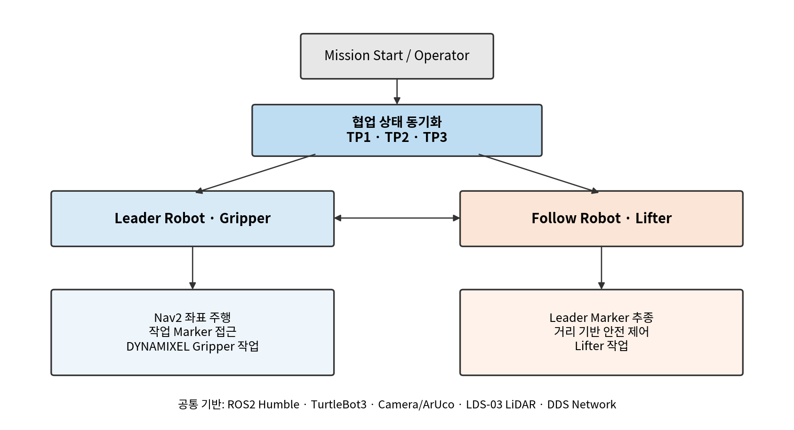

그림 1\. 최종 협업배송로봇 시스템 구성

# __2\. 실제 작업 환경 및 맵 구성__

실제 시험장은 중앙의 공용 주행 통로를 기준으로 양측에 작업 공간을 배치하였다\. 제공된 현장 사진 기준으로 화면 왼쪽은 Gripper 작업 구역, 화면 오른쪽은 Lifter 작업 구역이다\. 두 로봇은 중앙 통로에서 Leader\-Follower 형태로 이동한 뒤 각 TP의 상태에 따라 분기 또는 재합류한다\.

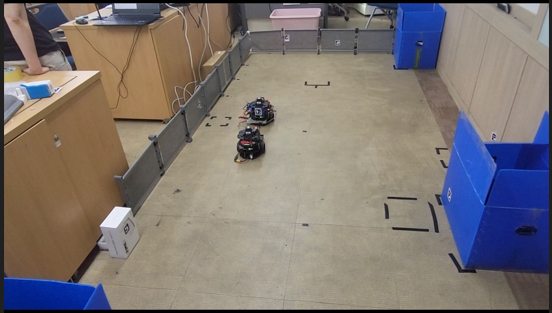

그림 2\. 실제 시험장 전경 \- 중앙 주행 통로와 양측 작업 공간

두 번째 사진은 오른쪽 작업 공간이 보다 명확하게 보이는 시점이다\. 사진 속 두 로봇이 중앙 통로에서 세로로 정렬된 위치는 최종 시나리오에서 TP3 구간으로 해석하며, 이후 Leader와 Follow가 각자의 하역 작업 위치로 분기한다\.

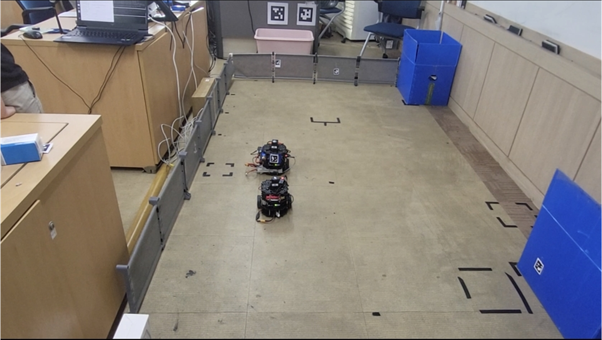

그림 3\. TP3 구간 및 우측 Lifter 하역 작업 공간이 보이는 실제 맵

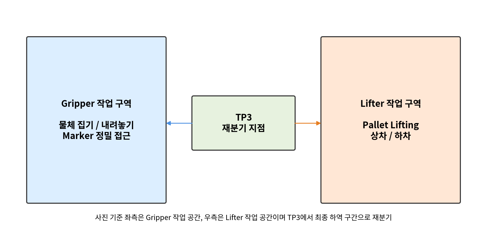

그림 4\. 실제 맵 사진을 기준으로 정리한 최종 작업 구역 개념도

# __3\. 최종 로봇 HW/FW 구성__

본 프로젝트의 두 로봇은 동일한 TurtleBot3 이동 플랫폼을 기반으로 하지만, 작업 목적에 따라 상부 작업장치를 다르게 구성하였다\. Leader는 물체를 직접 집고 놓는 Gripper를, Follow는 Pallet을 들어 올리고 내리는 Lifter를 장착한다\. 두 장치는 상용 완제품을 단순 부착한 것이 아니라 제어보드, 구동기, 센서 및 포맥스 프레임을 조합하여 제작하였다\.

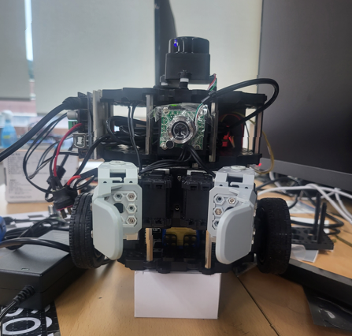

그림 5\-1\. Gripper 장착 Leader Robot

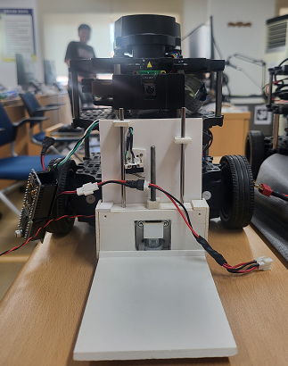

그림 5\-2\. Lifter 장착 Follow Robot

*※ Lifter 장착 로봇 사진은 LiDAR 형상 변경 전에 촬영한 사진이다\. 현재 실제 구성의 LiDAR는 Gripper 장착 로봇과 동일한 형상으로 변경되어 있으며, 사진은 Lifter 기구 배치와 장착 상태를 설명하기 위한 기록으로 사용한다\.*

__Follow Robot의 LiDAR는 개발 초기에 사용하던 형상에서 통합 단계 중 교체되었으며, 최종 구성에서는 Leader Robot과 동일한 LDS\-03 LiDAR 형상으로 통일하였다\. 따라서 초기 사진에 보이는 상부 센서 외형은 개발 이력 자료이며 최종 시스템 Baseline의 센서 구성은 두 로봇이 동일하다\.__

## __3\.1 Leader Robot \- Gripper 최종 구성__

설계 단계에서는 2개의 DYNAMIXEL과 Gripper Frame을 좌우 대칭으로 배치한 3D 모델과 다면 도면을 기준 형상으로 사용하였다\. 실제 제작에서는 포맥스 가공 공차, 로봇 장착 공간, 케이블 배선 및 프레임 간섭을 확인하면서 체결 위치와 일부 판재 형상을 소폭 수정하였다\. 다만 2축 대칭 개폐와 후면 장착판이라는 핵심 구조는 설계 모델을 유지하였다\.

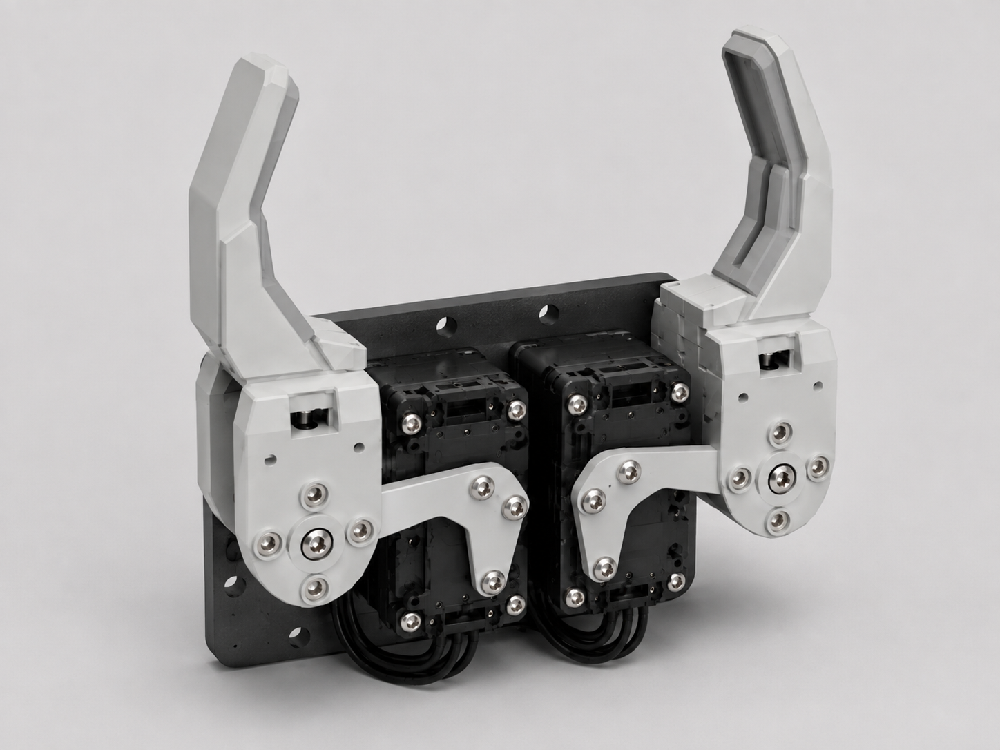

그림 5\-3\. Gripper 설계 모델 \- 제작 전 기준 형상

그림 5\-4\. Gripper 설계 도면 \- 다면 형상 검토

__구성 요소__

__최종 적용 내용__

__역할__

제어보드

DYNAMIXEL Shield

2개의 DYNAMIXEL 제어 및 Gripper 구동 인터페이스

Actuator

DYNAMIXEL 2EA

좌우 대칭 회전축을 구성하여 Gripper Frame 개폐

Gripper Frame

Gripper Frame 2EA

물체를 양쪽에서 파지/해제

장착 구조

포맥스 2T / 3T / 5T 조합

로봇 고정판, 간격 확보, 구조 보강 및 케이블 정리

기구 구조

DYNAMIXEL 2개를 후면 판에 대칭 배치

두 회전축에 Gripper Frame을 연결하여 좌우 대칭 개폐

사전 검토

Blender 모델링

실물 제작 전 대칭 배치, 장착판 크기, 프레임 간섭과 형상 확인

## __3\.2 Follow Robot \- Lifter 최종 구성__

Lifter 역시 3D 모델과 다면 도면을 바탕으로 프레임, 가이드, 승강판, Motor 및 Limit Switch 배치를 검토하였다\. 실제 제작 단계에서는 포맥스 가공성과 로봇 장착 위치, 승강 Stroke, Micro Switch가 확실하게 눌리는 종단 위치를 기준으로 일부 브래킷과 체결 위치를 조정하였다\. 따라서 최종 실물은 설계 모델과 세부 형상이 일부 다르지만, Arduino Pro Micro \+ TB6612FNG \+ Geared DC Motor \+ 상·하단 Limit Switch라는 제어 구조와 승강 원리는 동일하다\.

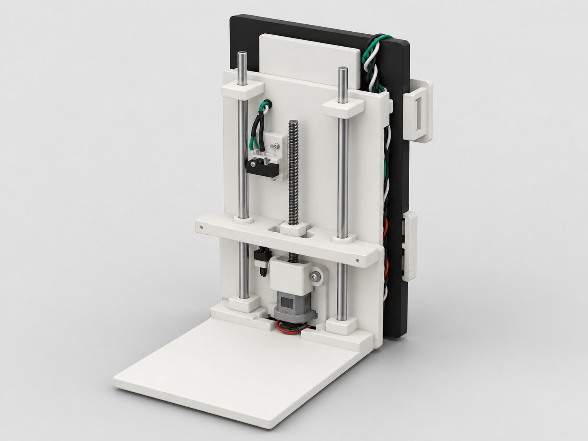

그림 5\-5\. Lifter 설계 모델 \- 제작 전 기준 형상

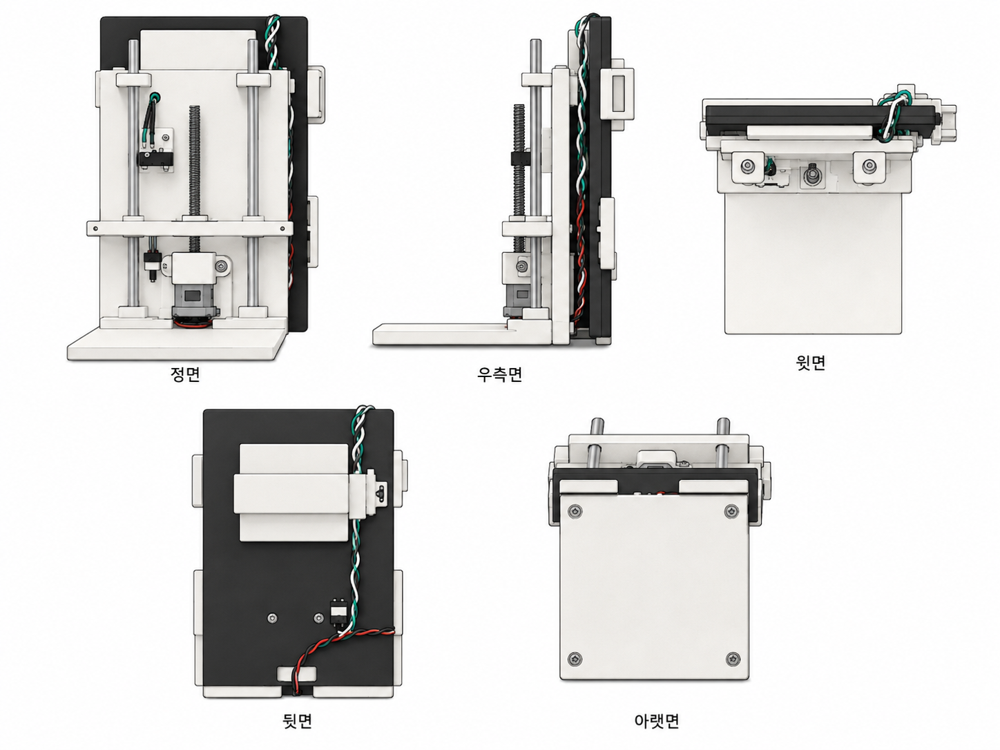

그림 5\-6\. Lifter 설계 도면 \- 다면 형상 검토

__구성 요소__

__최종 적용 내용__

__역할__

제어보드

Arduino Pro Micro

Lifter 구동 로직 및 Limit 입력 처리

Motor Driver

Toshiba TB6612FNG

H\-Bridge 기반 DC Motor 정·역회전 제어, 환류 다이오드 기능 포함

Motor

Metal Geared Micro DC Motor

Lifter 승강 구동

Limit Sensor

TIAIHUA Micro Switch 2EA

상단/하단 종단 위치 검출 및 과구동 방지

Frame

포맥스 2T / 3T / 5T 조합

Lifter 가이드, 로봇 장착부, 전면 작업판 및 구조 보강

FW 안전 로직

UP/DOWN \+ 상·하단 Limit 정지

종단 도달 후 추가 구동 방지 및 반복 동작 안정화

# __4\. 최종 협업 시나리오__

최종 시나리오는 두 로봇이 동일한 경로를 단순히 함께 주행하는 방식이 아니라, 각 로봇의 작업 순서를 TP 상태로 동기화하고 작업 구역에서 역할을 분담하는 구조이다\. TP1/TP2/TP3는 단순 좌표명이 아니라 상대 로봇이 다음 행동을 시작해도 되는지를 확인하는 협업 Barrier로 사용한다\.

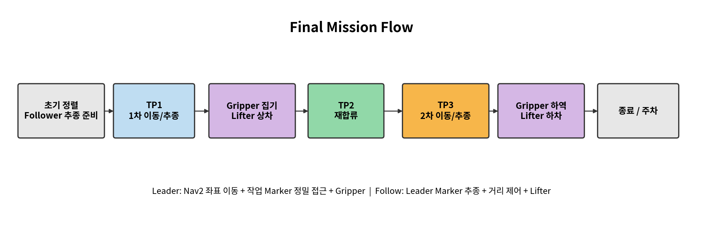

그림 6\. Final Mission Flow \- TP1/TP2/TP3 기반 협업 흐름

## __4\.1 단계별 최종 동작__

__단계__

__Leader Robot__

__Follow Robot__

__협업 의미__

초기 준비

작업 시작 대기

Leader Marker 인식 및 추종 준비

Follower가 추종 가능한 상태 확보

TP1

좌표 기반 1차 작업 분기 지점 이동

Leader Marker 추종 및 안전거리 유지

Follower의 go/arrive를 통해 1차 작업 시작 시점 동기화

1차 작업

Gripper 작업 구역에서 물체 집기 후 복귀

Lifter 작업 구역에서 Pallet 상차 후 복귀 준비

양 로봇이 서로 다른 작업장치를 병렬 수행

TP2

복귀 위치 도착 후 Follow 합류 허가

TP2로 복귀/재합류 후 arrive

재합류 전 경로 충돌 방지

TP3

하역 대기 위치 도착 후 Follow 이동 허가

Leader 뒤를 추종하여 TP3 정렬

하역 전 두 로봇의 위치/순서 재정렬

2차 작업

좌측 Gripper 하역 작업 후 주차 절차

우측 Lifter 하역 작업 수행

사진 2의 TP3 위치에서 각 작업 공간으로 재분기

종료

Marker 기반 최종 정렬 및 주차

최종 임무 상태 전환

각 로봇의 작업 완료 상태 확정

# __5\. 구현 결과 \- 역할별 정리__

## __5\.1 Leader Robot 개발 결과__

- Nav2를 이용한 좌표 Goal 기반 장거리 이동과 작업 대기 위치 복귀 기능을 구성하였다\.
- 작업 구간에서는 ArUco Marker를 여러 번 관측하고 상대 거리·각도를 기반으로 정밀 접근하는 방식으로 보완하였다\.
- 작업 Marker에 가까이 붙은 상태에서 Nav2가 Costmap 장애물로 경로를 생성하지 못하는 문제를 줄이기 위해 Gripper 작업 후 후진한 뒤 좌표 주행으로 복귀하도록 시나리오를 수정하였다\.
- DYNAMIXEL Shield와 DYNAMIXEL 2축 Gripper를 Mission 동작과 연계하여 집기/하역 순서를 구성하였다\.
- 최종 단계에서 작업 Marker와 주차 Marker를 활용하는 주차 흐름을 설계 Baseline으로 확정하였다\.

## __5\.2 Follow Robot 개발 결과__

통합 단계에서 Follow Robot의 LiDAR 센서를 Leader Robot과 동일한 LDS\-03 형상으로 변경하여 두 로봇의 센서 구성과 실행 절차를 통일하였다\. 이전 형상의 LiDAR가 보이는 사진은 변경 전 Prototype 기록으로 유지한다\.

- Leader Marker를 기반으로 상대 위치를 인식하고 Follower가 앞 로봇을 추종하도록 구성하였다\.
- 일정 거리 이상에서는 추종 속도를 높이고, 가까워질수록 감속하며, 안전거리 안에서는 정지하도록 거리 기반 제어를 적용하였다\.
- Leader가 정지한 상태에서 Follower가 계속 접근하여 추돌할 수 있는 문제를 보완하기 위해 Leader의 정지 상태와 Marker 갱신 상태를 도착 판정에 함께 사용하였다\.
- 분기 작업에서 Lifter를 구동하고 복귀 후 TP 상태에 따라 다음 이동을 시작하는 상태 흐름을 구성하였다\.
- Lifter의 상·하단 Limit Switch를 이용해 FW가 종단에서 Motor를 정지하도록 하여 기구 과구동 위험을 낮추었다\.

## __5\.3 Gripper/Lifter FW 및 기구 개발 결과__

- Gripper는 Blender 모델링을 통해 두 DYNAMIXEL과 두 Gripper Frame의 대칭 배치를 먼저 검토한 후 포맥스 판재를 절단·조합하여 실제 로봇에 장착하였다\.
- 포맥스는 2T, 3T, 5T를 위치별 강성과 간격 요구에 맞게 조합하여 로봇 장착판, 보강판, 작업 프레임으로 사용하였다\.
- Lifter는 Arduino Pro Micro와 TB6612FNG, Geared DC Motor, Micro Switch 2EA를 조합해 별도의 승강 장치를 직접 구성하였다\.
- 기구 제작은 단순 외형 완성이 아니라 로봇 바퀴·센서·케이블과의 간섭, 프레임 흔들림, Limit Switch 작동 위치를 반복 시험하며 수정하였다\.

*설계 모델 대비 실제 제작 변경은 실패가 아니라 실물 통합 과정에서 발생한 Engineering Change로 관리하였다\. Gripper는 체결 위치와 간섭 회피를, Lifter는 가이드 정렬과 Limit Switch 작동 위치를 중심으로 수정했으며, 최종 문서에서는 설계 형상과 As\-Built 형상을 구분해 기록한다\.*

# __6\. 개발 과정에서 확인된 문제와 최종 개선 결과__

__Issue__

__초기 현상__

__개선 내용__

__최종 반영__

Follower 추돌 위험

Leader 정지 후에도 Follower가 접근

거리 기반 감속/정지 \+ Leader 정지 확인

TP1 arrive 판정과 추종 로직에 안전 조건 반영

Marker 검출 지연/손실

회전 중 Marker를 지나치거나 갱신 지연

정지 후 관측, 재탐색, stale 상태에서 정지

Marker 기반 접근 안정화

회전 방향 혼선

복귀/분기 후 좌우 회전 방향 오류

구간별 로봇 heading을 기준으로 방향 재정의

TP1/TP2/TP3 시나리오별 방향 수정

TP 상태 혼선

중복 노드/파라미터 소유권으로 값이 불안정

공유 상태 노드 단일화 및 변경 책임 분리

TP1/TP2/TP3 Handshake 구조 확립

Topic/Node 충돌

동일 ROS Domain에서 2대 로봇 정보 혼선 가능

로봇별 namespace 및 소유권 점검

실구동 전 필수 점검 항목으로 고정

Nav2 접근 실패

Marker 앞 장애물 영역에서 복귀 Goal 실패

작업 직후 일정 거리 후진 후 Nav2 재개

Leader 작업 시퀀스에 후진 단계 추가

Gripper 기구 간섭

2축 개폐 시 프레임 간섭/장착 위치 검토 필요

Blender 사전 모델링 \+ 포맥스 장착판 재조정

대칭 2축 Gripper 구조 확정

Lifter 과구동

DC Motor 종단에서 계속 구동 가능

상/하 Micro Switch 2EA \+ FW Limit 정지

반복 UP/DOWN 안전 조건 반영

기구 강성/장착

포맥스 프레임 두께별 강성 차이

2T/3T/5T 조합 및 보강

실제 로봇 장착 구조에 반영

# __7\. 시험 및 검증 결과 정리__

현재 문서 기준 시점은 8월 20일이다\. 개발 중 개별 기능과 연동 동작에서 확인된 항목은 “확인”, 프로젝트 종료 전 전체 Mission 반복 시험이 필요한 항목은 “최종 검증 예정”으로 구분한다\. 또한 실제 시연 영상의 컷 이미지를 이용해 로봇의 추종·분기·재합류·하역 이동 흐름을 시각적으로 함께 검증한다\.

__Test ID__

__시험 항목__

__현재 상태__

__판정/비고__

UT\-01

TurtleBot3 기본 주행 및 회전

확인

개별 구동 및 방향 제어 시험 수행

UT\-02

Camera / ArUco Marker 검출

확인

ID 및 상대 Pose 수신 확인

UT\-03

Leader Nav2 좌표 이동

확인

Goal 기반 주행 기능 확보

UT\-04

Follower Leader Marker 추종

확인

거리 기반 감속/정지 로직 포함

UT\-05

Gripper DYNAMIXEL 2축 개폐

확인

실제 Gripper 장착 및 구동 연동

UT\-06

Lifter UP/DOWN 및 Limit Switch

확인

TB6612FNG 정·역회전과 상·하단 정지 구조 적용

IT\-01

Leader Marker 접근 \+ Gripper 작업

통합 확인 중

작업 접근/집기/후진/복귀 흐름 구성

IT\-02

Follow Marker 추종 \+ Lifter 작업

통합 확인 중

추종/분기/Lifter/복귀 흐름 구성

IT\-03

TP1/TP2/TP3 협업 상태

통합 확인 중

go/arrive 주체와 순서 Baseline 확정

SYS\-01

전체 Mission End\-to\-End 완주

최종 검증 예정

8/21~8/22 반복 수행 및 로그 기록

SYS\-02

실제 맵 좌/우 작업공간 하역 및 종료

최종 검증 예정

TP3 재분기 후 양측 작업 완료 확인

SYS\-03

Gripper/Lifter 반복 작업 안정성

최종 검증 예정

기구 흔들림, Limit, 파지/승강 반복 확인

## __7\.1 실제 Mission 시연 영상 컷 기반 동작 확인__

개발 중 촬영한 시연 영상을 단계별로 컷 편집하여 실제 로봇의 이동·추종·분기·재합류·하역 구간을 확인하였다\. 아래 이미지는 전체 영상을 모두 나열하지 않고, Mission 흐름의 변화가 명확하게 나타나는 장면만 선별한 것이다\. 영상 컷은 기능 수행 여부를 시각적으로 확인하기 위한 증빙 자료이며, 반복 성공률과 장시간 안정성 평가는 프로젝트 종료 전 End\-to\-End 반복시험에서 별도로 확정한다\.

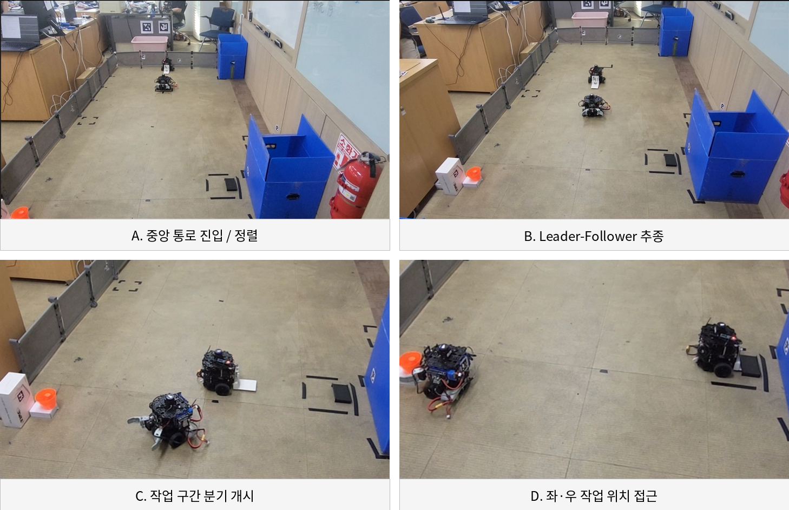

그림 7\. 실제 시연 영상 컷 1 \- 중앙 통로 정렬·추종에서 1차 작업 분기까지

A~D 구간에서는 두 로봇이 중앙 통로에서 Leader\-Follower 형태로 정렬한 뒤, Follow 로봇이 선행 로봇을 추종하고 작업 지점에서 좌·우 작업 공간으로 분리되는 과정을 확인할 수 있다\. 좌측은 Gripper 작업 공간, 우측은 Lifter 작업 공간이며 분기 이후에는 각 로봇이 자신의 작업장치가 배치된 위치로 접근한다\.

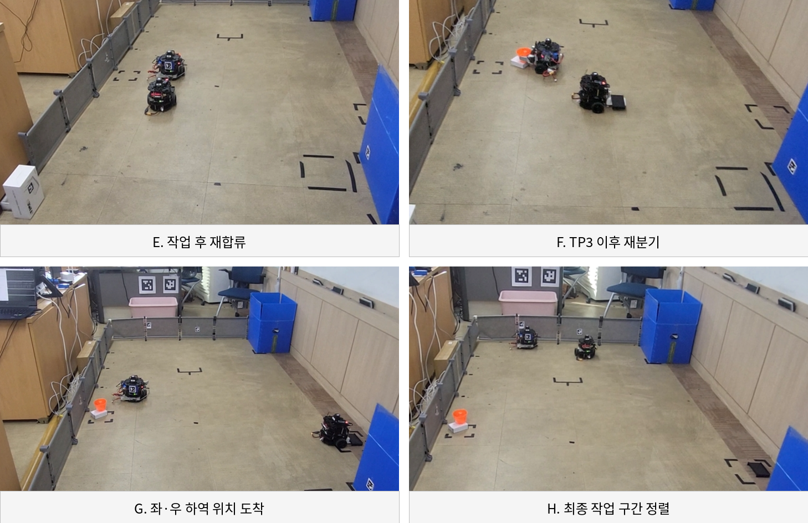

그림 8\. 실제 시연 영상 컷 2 \- 작업 후 재합류와 TP3 이후 최종 하역 분기

E~H 구간에서는 개별 작업을 마친 로봇이 다시 중앙 통로로 복귀하여 재합류한 뒤, 다음 협업 구간으로 이동하고 TP3 이후 최종 하역 작업을 위해 다시 좌·우로 분리되는 흐름을 확인할 수 있다\. 이 장면은 단순한 2대 동시주행이 아니라, 공용 통로와 독립 작업구역을 반복적으로 전환하는 협업 시나리오가 실제 환경에서 구현되었음을 보여준다\.

__영상 구간__

__관찰된 동작__

__결과 해석__

A~B

중앙 통로 정렬 및 Leader\-Follower 추종

두 로봇이 동일 주행축에서 순차 이동

C~D

작업 위치 분기 및 개별 접근

좌측 Gripper / 우측 Lifter 작업공간으로 분리

E

작업 후 중앙 통로 재합류

작업 종료 후 다음 협업 구간 준비

F

TP3 이후 재분기

최종 하역 단계 진입

G~H

좌·우 하역 위치 정렬

각 로봇이 독립 작업 위치에 도착하여 최종 작업 수행 준비

*※ 영상 컷은 단일 시연 흐름의 대표 장면을 선별한 것이며, 최종 문서의 반복 성공률·성능 수치는 별도의 반복시험 결과가 확보된 뒤 기록한다\.*

# __8\. 최종 시스템 Baseline 및 산출물__

__영역__

__최종 Baseline / 산출물__

Leader SW

Nav2 좌표 주행 \+ Marker 접근 \+ Gripper Mission \+ 복귀/주차 상태 흐름

Follow SW

Leader Marker 추종 \+ 거리 안전제어 \+ 분기/복귀 \+ Lifter Mission

협업

TP1/TP2/TP3 ready/go/arrive 기반 상태 동기화 및 경로 충돌 방지

Gripper HW/FW

DYNAMIXEL Shield \+ DYNAMIXEL 2EA \+ Gripper Frame 2EA \+ 포맥스 2T/3T/5T 장착구조

Lifter HW/FW

Arduino Pro Micro \+ TB6612FNG \+ Metal Geared Micro DC Motor \+ TIAIHUA Micro Switch 2EA \+ 포맥스 프레임

시험환경

실제 실내 Map, 좌측 Gripper 작업 공간, 우측 Lifter 작업 공간, 중앙 TP 이동/재합류 구간

문서

01 계획서 / 02 시스템 설계·개발 문서 / 03 개발 결과 정리 문서

# __9\. 프로젝트 성과 및 기술적 의미__

본 프로젝트의 결과는 단순한 TurtleBot3 두 대의 이동 시연이 아니라, 서로 다른 작업장치를 장착한 두 로봇이 하나의 배송 Mission을 나누어 수행하도록 이동·인지·작업·통신을 통합한 데 의미가 있다\. Leader는 Nav2의 절대 좌표 이동 능력과 Marker 기반 국소 정밀 접근을 결합하고, Follow는 상대 Marker 추종과 거리 기반 안전 제어를 담당하여 각 로봇의 제어 목적을 분리하였다\.

또한 Gripper와 Lifter를 로봇에 맞추어 직접 설계·제작함으로써 SW 동작만으로 끝나는 프로젝트가 아니라, FW와 기구가 실제 Mission 상태와 연결되는 Cyber\-Physical System 형태로 완성도를 높였다\. 특히 통합 과정에서 발생한 충돌 위험, 통신 혼선, Marker 지연, 방향 오류, 기구 간섭과 Limit 문제를 반복적으로 수정하며 초기 설계를 최종 Baseline으로 발전시킨 점이 핵심 개발 성과이다\.

# __10\. 한계 및 향후 개선 방향__

__구분__

__현재 한계__

__향후 개선 방향__

Localization

실내 맵과 초기 Pose 설정에 의존

자동 초기화, AprilTag/SLAM 기반 보정, 다중 센서 융합 검토

Marker 인식

조명/각도/프레임 지연에 영향

검출 주기 최적화, 압축 전송, Camera 성능 및 Marker 배치 개선

협업 상태

TP 기반 상태 동기화가 특정 시나리오에 맞춰져 있음

일반화된 Mission State/Action 또는 Fleet Manager 구조로 확장

충돌 방지

Follower 안전거리와 순서 제어 중심

다중 로봇 Traffic/Reservation, LiDAR 기반 상대 안전영역 추가

Gripper

정해진 형상과 위치 중심의 파지

힘/전류 기반 파지 감지, 다양한 물체 대응 Frame 개선

Lifter

Limit Switch 기반 종단 제어

Encoder 또는 위치 센서 추가, 하중/높이 피드백 제어

기구

포맥스 수작업 제작으로 치수 반복성 한계

3D Print/CNC/금속 브래킷 기반 구조 정밀도 및 강성 개선

# __11\. 프로젝트 종료 전 최종 확인 항목__

- 실제 Map에서 TP1 → 1차 작업 → TP2 → TP3 → 2차 작업 → 종료/주차까지 End\-to\-End Mission을 반복 수행한다\.
- TP3 위치에서 화면 기준 좌측 Gripper 하역 구역과 우측 Lifter 하역 구역으로 정상 분기되는지 확인한다\.
- Gripper가 물체 파지/해제를 반복할 때 DYNAMIXEL 2축, Gripper Frame 및 포맥스 장착판에 간섭이나 풀림이 없는지 확인한다\.
- Lifter가 상·하단까지 반복 이동할 때 TIAIHUA Micro Switch 2EA가 매번 Limit를 검출하고 Motor를 안전하게 정지시키는지 확인한다\.
- Lifter 로봇의 실제 LiDAR 구성이 Gripper 로봇과 동일한 최종 형상임을 시연 및 최종 사진 자료에서 통일한다\.
- ROS2 Node/Topic/Namespace 및 공유 TP 상태가 중복 없이 동작하는지 최종 로그를 저장한다\.

# __12\. 결론__

20일 프로젝트는 초기의 단순 Leader\-Follower 이동 아이디어에서 시작하여, 실제 로봇 통합시험을 통해 좌표 주행, Marker 기반 상대 제어, 작업장치, 안전거리, 협업 상태 동기화가 결합된 배송 로봇 시스템으로 발전하였다\. 최종 Baseline에서는 Leader의 Gripper와 Follow의 Lifter가 서로 다른 작업 공간을 담당하며, 중앙 주행 구간에서는 TP 상태를 사용해 분기와 재합류 순서를 제어한다\.

이 문서는 8월 20일 기준 구현 결과와 최종 설계 Baseline을 정리한 상태이며, 8월 21~22일 End\-to\-End 시험 결과를 추가하면 프로젝트의 실제 성공/실패 로그와 반복 안정성까지 포함한 최종 결과 보고서로 확정할 수 있다\.

